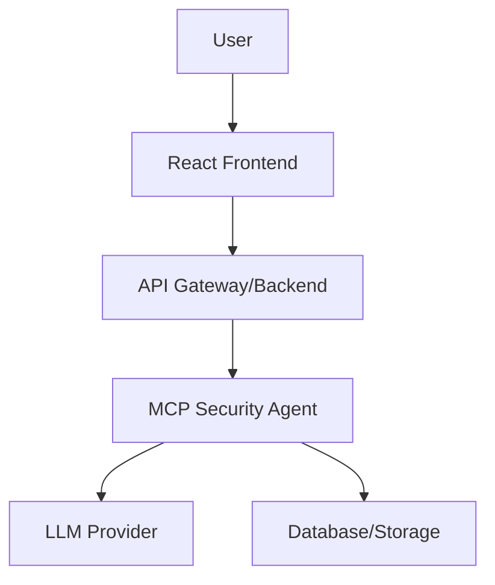

# Frontend UI Chat Interface Full-Stack Architecture Document

## Introduction

This document outlines the complete full-stack architecture for the Frontend UI Chat Interface project, including backend systems, frontend implementation, and their integration. It serves as the single source of truth for development, ensuring consistency across the technology stack.

### Starter Template or Existing Project

Greenfield project based on PRD and UX Spec.

### Change Log

| Date       | Version | Description                   | Author          |
| ---------- | ------- | ----------------------------- | --------------- |
| 2025-11-26 | v1.0    | Initial architecture document | Architect Agent |

## High Level Architecture

### Technical Summary

The Frontend UI Chat Interface is a web application that allows users to upload PDFs, automatically process them using the MCP Security Agent's tools, and interact via a chat interface. The architecture consists of a React frontend for the UI, integration with the existing MCP Security Agent backend, and supporting infrastructure for security and performance.

### Platform and Infrastructure Choice

**Platform:** Web-based (can be deployed to AWS or similar)  
**Key Services:** Existing MCP Security Agent backend, web server for frontend  
**Deployment Host:** Docker container with web server

### Repository Structure

**Structure:** Polyrepo (separate frontend repo)  
**Frontend:** React/TypeScript  
**Backend:** Integration with existing MCP Security Agent

### High Level Architecture Diagram

## Frontend Architecture

### Technology Stack

- **Framework:** React 18 with TypeScript
- **State Management:** Redux Toolkit or Context API
- **UI Library:** Material-UI or Shadcn/UI
- **Build Tool:** Vite
- **Testing:** Jest, React Testing Library

### Component Architecture

- **Layout Components:** Header, Sidebar, Main Content
- **Feature Components:** UploadZone, ChatInterface, ProgressIndicator
- **Shared Components:** Button, Input, Modal

### State Management

- Global state for chat history, document status
- Local state for UI interactions

## Backend Architecture

### Technology Stack

- **Framework:** Existing MCP Security Agent (Python/Node.js)
- **APIs:** REST/WebSocket for real-time chat
- **Database:** Existing agent storage
- **Security:** HTTPS, input validation

### API Design

- **Endpoints:** /upload, /sanitize, /enhance, /chat
- **Authentication:** API keys
- **Error Handling:** Standardized error responses

## Infrastructure and Deployment

### Deployment Strategy

- **Frontend:** Static hosting (e.g., AWS S3 + CloudFront)
- **Backend:** Existing agent deployment
- **CI/CD:** GitHub Actions for frontend builds

### Security Considerations

- Client-side validation
- No permanent file storage
- Rate limiting
- HTTPS encryption

## Integration Points

### Agent Integration

- Direct API calls to MCP Security Agent tools
- Asynchronous processing for uploads
- Real-time chat via WebSocket or polling

### External Dependencies

- MCP Security Agent backend
- LLM provider (Gemini)
- File storage (ephemeral)

## Performance and Scalability

### Performance Goals

- Page load < 3s
- Processing < 60s for 10MB PDFs
- Responsive UI

### Scalability Considerations

- Stateless frontend
- Backend handles load
- CDN for static assets

## Security Architecture

### Threat Model

- File upload vulnerabilities
- Data exfiltration
- Unauthorized access

### Security Controls

- Input sanitization
- HTTPS everywhere
- No persistent storage
- Audit logging

## Testing Strategy

### Frontend Testing

- Unit tests for components
- Integration tests for API calls
- E2E tests with Cypress

### Backend Testing

- Leverage existing agent tests
- API contract testing

## Monitoring and Observability

### Logging

- Frontend error tracking
- Backend integration logs

### Metrics

- Upload success rate
- Processing time
- User engagement

## Next Steps

1. Set up frontend repository
2. Implement basic UI skeleton
3. Integrate with backend APIs
4. Testing and deployment

This architecture aligns with the PRD requirements and UX specifications, providing a solid foundation for development.
