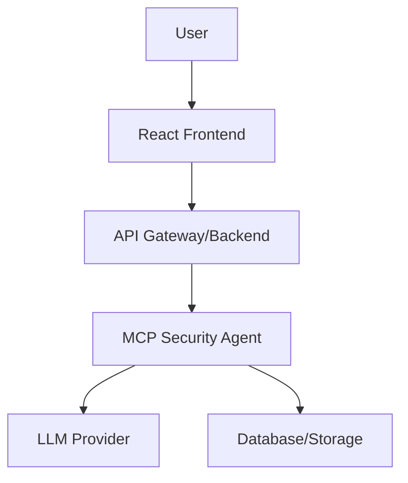

# High Level Architecture

## Technical Summary

The Frontend UI Chat Interface is a web application that allows users to upload PDFs, automatically process them using the MCP Security Agent's tools, and interact via a chat interface. The architecture consists of a React frontend for the UI, integration with the existing MCP Security Agent backend, and supporting infrastructure for security and performance.

## Platform and Infrastructure Choice

**Platform:** Web-based (can be deployed to AWS or similar)  
**Key Services:** Existing MCP Security Agent backend, web server for frontend  
**Deployment Host:** Docker container with web server

## Repository Structure

**Structure:** Polyrepo (separate frontend repo)  
**Frontend:** React/TypeScript  
**Backend:** Integration with existing MCP Security Agent

## High Level Architecture Diagram

