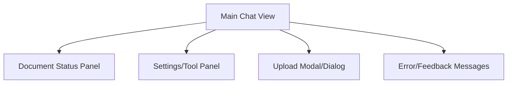
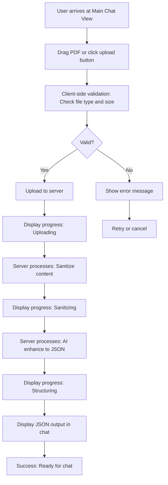
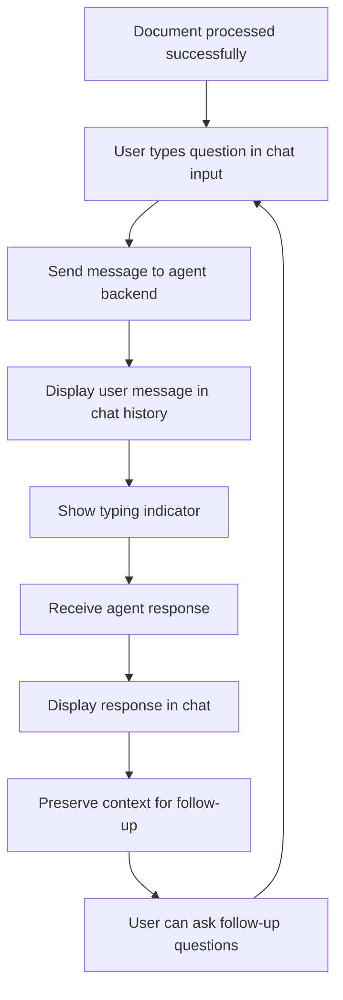

# Frontend UI Chat Interface UI/UX Specification

## Introduction

This document defines the user experience goals, information architecture, user flows, and visual design specifications for Frontend UI Chat Interface's user interface. It serves as the foundation for visual design and frontend development, ensuring a cohesive and user-centered experience.

## Overall UX Goals & Principles

### Target User Personas

- **Security Analyst:** Professionals responsible for reviewing and analyzing documents for security threats, compliance, and intelligence purposes. They currently use command-line tools or disconnected applications for PDF processing, spending significant time on manual data cleaning and structuring. Their primary needs include rapid document sanitization, automated data extraction, and the ability to ask complex analytical questions about document content. They aim to reduce processing time from hours to minutes while maintaining high accuracy and security standards.

- **General Business User:** General business users include managers, researchers, and professionals who need to analyze documents but lack deep technical expertise. They struggle with complex tools and require intuitive interfaces for document processing tasks. Their needs focus on ease of use, quick insights, and the ability to handle various document types without specialized training.

### Usability Goals

- Ease of learning: New users can complete core tasks within 5 minutes
- Efficiency of use: Power users can complete frequent tasks with minimal clicks
- Error prevention: Clear validation and confirmation for destructive actions
- Memorability: Infrequent users can return without relearning

### Design Principles

1. **Clarity over cleverness** - Prioritize clear communication over aesthetic innovation
2. **Progressive disclosure** - Show only what's needed, when it's needed
3. **Consistent patterns** - Use familiar UI patterns throughout the application
4. **Immediate feedback** - Every action should have a clear, immediate response
5. **Accessible by default** - Design for all users from the start

## Change Log

| Date       | Version | Description                              | Author        |
| ---------- | ------- | ---------------------------------------- | ------------- |
| 2025-11-26 | 1.0     | Initial Draft from PRD                   | Analyst Agent |
| 2025-12-04 | 1.1     | Added Sanitization Summary Messages spec | PO            |

## Information Architecture (IA)

### Site Map / Screen Inventory

### Navigation Structure

**Primary Navigation:** The main chat interface serves as the primary navigation hub, with the chat history and input field as the central focus.

**Secondary Navigation:** Tool buttons and settings panel accessible via a sidebar or toolbar for quick access to agent tools (e.g., Summarize, Extract Entities).

**Breadcrumb Strategy:** Not applicable for this single-page application; instead, use clear headings and status indicators to show current context (e.g., "Processing Document" or "Chat Active").

## User Flows

### Upload and Process PDF

**User Goal:** Upload a PDF document and have it automatically sanitized and structured into JSON for analysis.

**Entry Points:** Main Chat View via drag-and-drop zone or file input button.

**Success Criteria:** File uploaded successfully, processing completes with JSON output displayed, no errors.

**Flow Diagram**

**Edge Cases & Error Handling:**

- Invalid file type: Show "Only PDF files allowed" and prevent upload.
- File too large: Show "File exceeds 10MB limit" and suggest compression.
- Processing failure: Display error with retry option; log for debugging.
- Network timeout: Show "Upload failed, please check connection" with retry.

**Notes:** Assumes asynchronous processing to avoid blocking UI. Progress indicators provide feedback per PRD NFR.

### Interactive Chat with Agent

**User Goal:** Ask questions about the processed document and receive AI-powered responses.

**Entry Points:** After successful processing, via chat input field in Main Chat View.

**Success Criteria:** User sends message, agent responds with relevant analysis, context preserved.

**Flow Diagram**

**Edge Cases & Error Handling:**

- No document loaded: Disable chat input with "Upload a document first" message.
- Agent error: Show "Unable to process query, please try again" with retry.
- Long response: Show loading state; handle streaming if supported.
- Context loss: If session expires, prompt to re-upload.

**Notes:** Context preservation ensures conversational flow. Assumes backend handles agent logic.

## Wireframes & Mockups

**Primary Design Files:** Conceptual wireframes will be created in Figma (link TBD after creation). For now, focus on low-fidelity layouts described below. Detailed mockups will follow stakeholder review.

### Key Screen Layouts

#### Main Chat View

**Purpose:** Central hub for uploading, processing, and chatting with the agent.

**Key Elements:**

- Header: App title, basic branding, and user menu.
- Upload Zone: Drag-and-drop area with file input button.
- Chat History: Scrollable list of messages (user and agent).
- Input Field: Text box for user queries with send button.
- Progress Bar: Shows current processing step (e.g., "Sanitizing...").

**Interaction Notes:** Drag-and-drop triggers upload; chat input disabled until document is processed. Responsive: Stack vertically on mobile.

**Design File Reference:** Figma frame: "Main-Chat-Wireframe"

#### Document Status Panel

**Purpose:** Displays the status of the uploaded document and processing results.

**Key Elements:**

- Status Indicator: Icons/text for current state (Uploaded, Sanitized, Structured).
- Metadata: File name, size, upload time.
- JSON Preview: Collapsible section showing structured output.

**Interaction Notes:** Panel slides in/out or is always visible; click to expand JSON view.

**Design File Reference:** Figma frame: "Status-Panel-Wireframe"

#### Settings/Tool Panel

**Purpose:** Access to agent tools and app settings.

**Key Elements:**

- Tool Buttons: Summarize, Extract Entities, etc.
- Settings: Privacy policy link, theme toggle.
- Health Check: Agent status indicator.

**Interaction Notes:** Sidebar or dropdown; buttons trigger actions in chat.

**Design File Reference:** Figma frame: "Tools-Panel-Wireframe"

## Component Library / Design System

**Design System Approach:** Use an existing design system like Shadcn/UI (built on Radix UI and Tailwind CSS) for React, as it provides accessible, customizable components that align with our "Accessible by default" principle. If custom branding is needed, extend it minimally.

### Core Components

#### Button

**Purpose:** Trigger actions like sending messages or uploading files.

**Variants:** Primary (filled), Secondary (outlined), Icon-only.

**States:** Default, Hover, Disabled, Loading.

**Usage Guidelines:** Use primary for main actions (e.g., Send); secondary for less critical (e.g., Cancel). Ensure 44px min touch target for accessibility.

#### Input Field

**Purpose:** For chat messages and file inputs.

**Variants:** Text input, File input.

**States:** Default, Focused, Error, Disabled.

**Usage Guidelines:** Auto-resize for chat; show validation errors inline.

#### Chat Bubble

**Purpose:** Display user and agent messages.

**Variants:** User (right-aligned), Agent (left-aligned), Sanitization Summary (left-aligned, amber-themed).

**States:** Default, Loading (with typing indicator).

**Usage Guidelines:** Support markdown rendering; include timestamps.

#### Sanitization Summary Messages

**Purpose:** Display security alerts when significant content sanitization occurs during message processing.

**Trigger Conditions:**

- Automatically shown when message sanitization impact exceeds 5% of original content
- Impact calculated as: `(original_length - sanitized_length) / original_length > 0.05`

**Visual Design:**

- Amber color scheme (#F59E0B background, security shield icon)
- Distinct from regular agent messages
- Non-intrusive but clearly visible as security notifications

**Content Structure:**

- Header: "🛡️ Security Sanitization Alert"
- Metrics: Original/sanitized length, characters removed, impact percentage
- Advice: Contextual security recommendations based on what was removed
- Examples: "JavaScript code removed - XSS attempt neutralized", "HTML tags removed - content cleaned"

**Behavior:**

- Appears immediately after user message when threshold exceeded
- Precedes normal agent response
- Cannot be dismissed (permanent security record)
- Supports markdown formatting for detailed breakdowns

**Performance Impact:** <5% additional processing overhead for threshold calculation.

#### Progress Indicator

**Purpose:** Show processing steps.

**Variants:** Linear bar, Stepper.

**States:** In progress, Complete, Error.

**Usage Guidelines:** Use for upload/processing; provide text labels.

#### Modal/Dialog

**Purpose:** For confirmations or detailed views (e.g., full JSON).

**Variants:** Alert, Full-screen.

**States:** Open, Closed.

**Usage Guidelines:** Overlay for errors; ensure keyboard dismissal.

## Branding & Style Guide

**Visual Identity:** No specific brand guidelines provided; assume a clean, professional look with security-focused elements (e.g., trust indicators). If corporate branding exists, integrate it here.

### Color Palette

| Color Type | Hex Code                  | Usage                             |
| ---------- | ------------------------- | --------------------------------- |
| Primary    | #1976D2                   | Main actions, links, focus states |
| Secondary  | #424242                   | Secondary buttons, borders        |
| Accent     | #FFC107                   | Highlights, warnings              |
| Success    | #4CAF50                   | Positive feedback, confirmations  |
| Warning    | #FF9800                   | Cautions, important notices       |
| Error      | #F44336                   | Errors, destructive actions       |
| Neutral    | #9E9E9E, #EEEEEE, #FFFFFF | Text, borders, backgrounds        |

### Typography

#### Font Families

- **Primary:** Inter (sans-serif, modern and readable)
- **Secondary:** Roboto Mono (for code/JSON snippets)
- **Monospace:** Roboto Mono

#### Type Scale

| Element | Size     | Weight | Line Height |
| ------- | -------- | ------ | ----------- |
| H1      | 2rem     | 700    | 1.2         |
| H2      | 1.5rem   | 600    | 1.3         |
| H3      | 1.25rem  | 600    | 1.4         |
| Body    | 1rem     | 400    | 1.5         |
| Small   | 0.875rem | 400    | 1.4         |

### Iconography

**Icon Library:** Material Icons (free, accessible, consistent with Shadcn/UI).

**Usage Guidelines:** Use outlined icons for clarity; 24px default size; ensure high contrast.

### Spacing & Layout

**Grid System:** 8px base unit (e.g., 8, 16, 24px spacing).

**Spacing Scale:** xs: 4px, sm: 8px, md: 16px, lg: 24px, xl: 32px.

## Accessibility Requirements

**Compliance Target:** WCAG 2.1 AA (as specified in PRD for broad compatibility).

### Key Requirements

**Visual:**

- Color contrast ratios: 4.5:1 for normal text, 3:1 for large text.
- Focus indicators: 2px solid outline in primary color.
- Text sizing: Minimum 14px for body text, scalable to 200%.

**Interaction:**

- Keyboard navigation: All interactive elements reachable via Tab; Enter/Space for activation.
- Screen reader support: ARIA labels on components (e.g., "Upload PDF button").
- Touch targets: Minimum 44px for mobile.

**Content:**

- Alternative text: Descriptive alt text for icons/images.
- Heading structure: H1 for page title, H2 for sections.
- Form labels: Explicit labels for inputs, error messages linked.

### Testing Strategy

Manual testing with keyboard/screen reader; automated tools like axe-core in CI; user testing with assistive tech.

## Responsiveness Strategy

### Breakpoints

| Breakpoint | Min Width | Max Width | Target Devices              |
| ---------- | --------- | --------- | --------------------------- |
| Mobile     | 0px       | 767px     | Phones (portrait/landscape) |
| Tablet     | 768px     | 1023px    | Tablets, small laptops      |
| Desktop    | 1024px    | 1439px    | Laptops, desktops           |
| Wide       | 1440px    | -         | Large screens               |

### Adaptation Patterns

**Layout Changes:** Stack vertically on mobile (chat below upload); side-by-side on desktop.

**Navigation Changes:** Collapse tool panel to hamburger menu on mobile; full sidebar on desktop.

**Content Priority:** Prioritize chat history on mobile; show full JSON on desktop.

**Interaction Changes:** Touch-friendly buttons on mobile; hover states on desktop.

## Animation & Micro-interactions

**Motion Principles:** Subtle and purposeful—enhance feedback without distraction. Use easing for natural feel; respect user preferences (reduce motion).

### Key Animations

- **Upload Drag:** Fade-in highlight on drag-over (Duration: 0.2s, Easing: ease-in).
- **Progress Bar:** Smooth fill animation (Duration: 1s, Easing: linear).
- **Chat Bubble Appear:** Slide-in from bottom (Duration: 0.3s, Easing: ease-out).
- **Error Shake:** Gentle shake on validation error (Duration: 0.5s, Easing: ease-in-out).
- **Loading Spinner:** Rotate continuously (Duration: infinite, Easing: linear).

## Performance Considerations

### Performance Goals

- **Page Load:** < 3 seconds (as per PRD).
- **Interaction Response:** < 100ms for UI actions.
- **Animation FPS:** 60 FPS minimum.

### Design Strategies

Optimize images/icons; lazy-load chat history; use virtual scrolling for long chats; minimize re-renders with React memo.

## Next Steps

### Immediate Actions

1. Review spec with stakeholders.
2. Create Figma wireframes.
3. Hand off to Architect for frontend architecture.

### Design Handoff Checklist

- [ ] All user flows documented
- [ ] Component inventory complete
- [ ] Accessibility requirements defined
- [ ] Responsive strategy clear
- [ ] Brand guidelines incorporated
- [ ] Performance goals established

## Checklist Results

_No checklist run yet._
