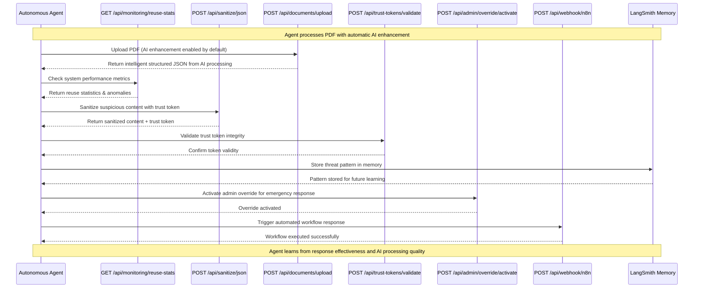

# Autonomous Security Agent Integration Architecture Document

## Overview

This document describes the architecture for integrating an autonomous security agent using DeepAgent CLI and LangSmith with the existing MCP-Security backend. The agent will learn from security data, monitor system activities, and orchestrate automated responses while leveraging the comprehensive backend API toolset.

### Bi-Directional AI Processing Pipeline

**New Capability**: Complete bi-directional AI intelligence for both inbound and outbound MCP traffic. The agent integrates Langchain and GPT models to transform unstructured data into intelligent, structured JSON outputs in both directions:

- **Inbound (Client → Server)**: PDF uploads automatically get AI enhancement → structured JSON
- **Outbound (Server → Client)**: JSON responses can optionally get AI enhancement → intelligent data

This transforms the entire sanitization pipeline from "dumb" text processing into an intelligent system that understands and structures content contextually.

**API Reference**: All backend API endpoints are fully documented in the [OpenAPI 3.0.3 specification](../openapi-spec.yaml), which serves as the authoritative source for API integration details.

## Architecture Principles

### Core Principles

- **Autonomous Learning**: Agent continuously learns from backend data sources to improve threat detection
- **API-First Integration**: All agent actions flow through existing backend APIs
- **Security by Design**: Agent operations maintain security guarantees of the backend
- **Scalable Architecture**: Agent can scale independently while integrating with backend services

### Design Decisions

- **Agent Framework**: DeepAgent CLI for agent management and LangSmith for memory/tracing
- **Integration Pattern**: REST API calls to existing backend endpoints
- **Data Flow**: Agent ingests data from monitoring endpoints and learning sources
- **Response Orchestration**: Agent triggers backend tools for automated actions

## System Context

```
┌─────────────────┐    ┌──────────────────────┐    ┌─────────────────┐
│   External      │    │  Autonomous Security │    │   MCP-Security  │
│   Systems       │◄──►│       Agent          │◄──►│    Backend      │
│                 │    │  (DeepAgent CLI +   │    │                 │
│ - User Requests │    │   LangSmith)        │    │ - APIs          │
│ - File Uploads  │    │                      │    │ - Database      │
│ - MCP Traffic   │    │                      │    │ - Sanitization  │
└─────────────────┘    └──────────────────────┘    └─────────────────┘
```

## Agent Architecture with Backend Integration

```mermaid
graph TB
    subgraph "Autonomous Security Agent"
        A[DeepAgent CLI] --> B[LangSmith Memory]
        A --> C[Learning Engine]
        A --> D[Monitoring Engine]
        A --> E[Orchestration Engine]
        A --> J[AI PDF Enhancement<br/>Engine]

        B --> F[Graph Database]
        C --> G[Pattern Recognition]
        D --> H[Anomaly Detection]
        E --> I[Response Actions]
        J --> K[Langchain Pipeline]
        J --> L[GPT Model Integration]
    end

      subgraph "Backend API Endpoints"
          L[POST /api/sanitize/json] --> M[Bi-Directional AI<br/>Sanitization + Trust Tokens]
          N[POST /api/trust-tokens/validate] --> O[Token Validation]
           P[POST /api/documents/upload] --> Q[AI-First PDF Processing<br/>(Default AI Enabled)]
           R[POST /api/documents/generate-pdf] --> S[PDF Generation]
          T[POST /api/webhook/n8n] --> U[N8N Integration]
          V[POST /api/export/training-data] --> W[Data Export]
          X[GET /api/monitoring/reuse-stats] --> Y[Performance Metrics]
          Z[GET /health] --> AA[System Health]
          BB[POST /api/admin/override/activate] --> CC[Admin Controls]
          DD[GET /api/jobs/{taskId}/status] --> EE[Async Job Status]
          FF[GET /api/jobs/{taskId}/result] --> GG[Async Job Results]
      end

    subgraph "Data Sources for Learning"
        DD[Risk Assessment Logs<br/>Story 9.1] --> EE[Structured Risk Data]
        FF[High-Risk Audit Trails<br/>Story 9.2] --> GG[ML-Optimized Data]
        HH[Pipeline Test Results<br/>Story 9.4.3.1.1] --> II[Performance Data]
        JJ[HITL Escalation<br/>Story 9.3] --> KK[Intervention Data]
    end

     A --> J
     A --> L
     A --> N
     A --> P
     A --> R
     A --> T
     A --> V
     A --> X
     A --> Z
     A --> BB
     A --> DD
     A --> FF

    X --> D
    Y --> D
    AA --> D

    EE --> C
    GG --> C
    II --> C
    KK --> C

    I --> BB
    I --> T
    I --> L

    style A fill:#e1f5fe
    style B fill:#f3e5f5
    style J fill:#e8f5e8
    style DD fill:#fff3e0
```

## Example Agent Traversal: Threat Detection & Response



## Component Architecture

### Agent Components

#### DeepAgent CLI Layer

- **Purpose**: Agent runtime and lifecycle management
- **Responsibilities**:
  - Agent deployment and configuration
  - Tool orchestration and execution
  - Integration with LangSmith for monitoring
- **Integration Points**: REST API calls to backend services

#### AI PDF Enhancement Engine

- **Purpose**: Intelligent text processing and structuring using Langchain and GPT
- **Components**:
  - Langchain Pipeline: Text processing workflows and chains
  - GPT Model Integration: OpenAI API for content transformation
  - Output Validation: Quality assurance for AI-generated content
  - Security Layer: Double sanitization (pre/post AI processing)
- **Capabilities**:
  - Text structuring and formatting improvement
  - Entity extraction and categorization
  - JSON schema generation from unstructured content
  - Content summarization and key point extraction

#### LangSmith Integration

- **Purpose**: Memory management, tracing, and analytics
- **Components**:
  - Graph database for agent memory
  - Trace collection for agent decisions
  - Analytics dashboard for performance monitoring
- **Data Flow**: Agent actions logged, memory persisted, learning data stored

#### Learning Engine

- **Purpose**: Continuous improvement through data analysis
- **Data Sources**:
  - Risk assessment logs (Story 9.1)
  - High-risk audit trails (Story 9.2)
  - Pipeline test results (Story 9.4.3.1.1)
  - Reuse statistics (/api/monitoring/reuse-stats)
- **Algorithms**: Pattern recognition, anomaly detection, supervised learning

### Backend Integration Points

#### API Gateway

- **Authoritative API Documentation**: See [openapi-spec.yaml](../openapi-spec.yaml) for complete API specifications
- **Agent Integration**: Agents automatically use synchronous processing mode via middleware
- **Endpoints Available to Agent** (15 total endpoints):
  - `POST /api/sanitize` - Basic text sanitization (backward-compatible, no trust tokens)
  - `POST /api/sanitize/json` - Advanced JSON sanitization with trust tokens and AI processing
  - `POST /api/sanitize/json` - JSON content sanitization with trust tokens (sync/async)
  - `POST /api/documents/upload` - PDF document processing
  - `POST /api/documents/generate-pdf` - PDF generation from content
  - `POST /api/webhook/n8n` - N8N workflow integration
  - `POST /api/trust-tokens/validate` - Trust token validation
  - `GET /api/jobs/{taskId}/status` - Async job status checking
  - `GET /api/jobs/{taskId}/result` - Async job result retrieval
  - `DELETE /api/jobs/{taskId}` - Async job cancellation
  - `GET /api/monitoring/reuse-stats` - Performance metrics and statistics
  - `POST /api/export/training-data` - Training data export for AI learning
  - `GET /health` - System health check
  - `POST /api/admin/override/activate` - Admin override activation
  - `DELETE /api/admin/override/{overrideId}` - Admin override deactivation
  - `GET /api/admin/override/status` - Admin override status

#### Security Components

- **Authentication**: API key or token-based auth for agent requests
- **Authorization**: Role-based access control for agent operations
- **Audit Logging**: All agent actions logged for compliance

#### Data Sources

- **Risk Assessment Database**: Structured logging from sanitization pipeline
- **Audit Trails**: High-fidelity logging with ML-optimized fields
- **Performance Metrics**: Real-time monitoring data
- **Training Data**: Exported datasets for agent learning

## Data Flow Architecture

### Learning Data Flow

```
Backend Data Sources → Agent Ingestion → LangSmith Memory → Learning Engine → Improved Models
```

### Monitoring Data Flow

```
System Activities → Backend APIs → Agent Monitoring → Anomaly Detection → Alert Generation
```

### Response Orchestration Flow

```
Threat Detection → Agent Decision → Backend API Call → Automated Action → Result Logging
```

### AI PDF Enhancement Flow

```
Raw PDF Text → Langchain Pipeline → GPT Processing → Structured Output → Validation → Sanitization → JSON Response
```

## Security Architecture

### Agent Security

- **Secure Communication**: HTTPS with mutual TLS for all API calls
- **Credential Management**: Secure storage of API keys and tokens
- **Access Control**: Least privilege principle for agent operations
- **Audit Trail**: Comprehensive logging of all agent actions

### Integration Security

- **API Security**: Existing backend security controls apply to agent requests
- **Data Protection**: Agent cannot access sensitive data directly
- **Trust Boundaries**: Clear separation between agent and backend security domains

### AI Processing Security

- **Double Sanitization**: Content sanitized before and after AI processing
- **Prompt Security**: AI prompts designed to prevent prompt injection attacks
- **Output Validation**: AI-generated content validated for malicious patterns
- **Rate Limiting**: AI API calls rate-limited to prevent abuse
- **Audit Trail**: All AI processing logged for security review

## Deployment Architecture

### Containerization

- **Agent Container**: Docker container with DeepAgent CLI and dependencies
- **Integration**: Kubernetes deployment with backend service mesh
- **Scaling**: Horizontal scaling of agent instances

### Infrastructure

```
┌─────────────────┐
│   Kubernetes    │
│    Cluster      │
├─────────────────┤
│ Agent Pods      │
│ Backend Pods    │
│ Database        │
│ LangSmith       │
└─────────────────┘
```

## Performance Architecture

### Scalability Considerations

- **Agent Instances**: Multiple agent pods for load distribution
- **Backend APIs**: Existing rate limiting and scaling mechanisms
- **Memory Management**: LangSmith handles agent memory scaling
- **Data Processing**: Asynchronous processing for heavy operations

### Performance Requirements

- **Response Time**: <500ms for routine monitoring, <100ms for alerts
- **Throughput**: Support 1000+ concurrent monitoring streams
- **Learning Overhead**: <2% performance degradation under load

## Monitoring and Observability

### Agent Monitoring

- **LangSmith Dashboard**: Real-time agent performance and decision tracking
- **Custom Metrics**: Agent-specific KPIs and health indicators
- **Alert Integration**: Agent alerts fed back into monitoring system

### Integration Monitoring

- **API Metrics**: Backend API usage by agent
- **Error Tracking**: Failed agent operations and recovery
- **Performance Analytics**: End-to-end latency and throughput

## Risk Assessment

### Technical Risks

- **API Compatibility**: Changes to backend APIs affecting agent functionality
- **Learning Accuracy**: Agent learning from incorrect or biased data
- **Performance Impact**: Agent operations overloading backend systems
- **AI Processing Risks**: GPT API failures, prompt injection, biased outputs
- **Content Security**: AI transformation potentially introducing vulnerabilities

### Mitigation Strategies

- **Versioned APIs**: Semantic versioning for backward compatibility
- **Data Validation**: Agent validates learning data quality
- **Rate Limiting**: Prevent agent from overwhelming backend services
- **AI Security**: Double sanitization, prompt validation, output filtering
- **Fallback Mechanisms**: Graceful degradation when AI services unavailable

## Implementation Roadmap

### Phase 1: Foundation

- DeepAgent CLI setup and basic API integration
- LangSmith configuration and memory initialization
- Basic monitoring and logging

### Phase 1.5: AI Enhancement Foundation

- Langchain and OpenAI API integration
- AI PDF enhancement tool development
- Security validation for AI processing pipeline

### Phase 2: Learning

- Data ingestion pipeline from backend sources
- Initial learning model training
- Performance monitoring and optimization
- AI processing quality assessment and improvement

### Phase 3: Orchestration

- Automated response implementation
- Advanced decision-making logic
- Integration testing and validation
- AI-enhanced document processing workflows

### Phase 4: Production

- Full deployment and scaling
- Continuous learning and improvement
- Operational monitoring and maintenance
- AI processing performance optimization

## Conclusion

This architecture provides a robust framework for integrating an autonomous security agent with the existing MCP-Security backend. The design leverages DeepAgent CLI and LangSmith for advanced agent capabilities while maintaining security and performance through careful API integration and monitoring.

The agent will enhance the system's security posture through continuous learning and automated responses, creating an intelligent, adaptive security solution. The addition of AI-powered PDF text enhancement transforms raw document processing into structured, intelligent content analysis, significantly improving the system's document intelligence capabilities.
