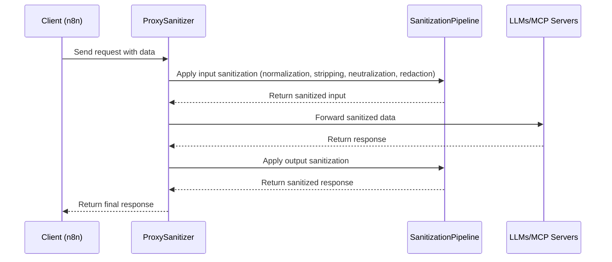

# High Level Architecture

## Technical Summary

The Obfuscation-Aware Sanitizer Agent adopts a proxy-based architecture style, acting as an intermediary layer between MCP servers and LLMs to perform real-time sanitization. Key components include the sanitization pipeline (normalization, stripping, neutralization, redaction), API endpoints for n8n integration, and cloud infrastructure for hosting. Primary technology choices emphasize Node.js or Python for backend development, with Docker for containerization and AWS/GCP for scalable deployment. Core architectural patterns such as the Proxy Pattern for request interception and Pipeline Pattern for sequential sanitization ensure modularity and efficiency. This architecture directly supports PRD goals by enabling secure, low-latency threat mitigation (≥90% neutralization, <100ms latency) while maintaining transparency for AI workflows, aligning with the need for resilient agentic AI systems.

## High Level Overview

1. **Main Architectural Style:** Proxy-based architecture, where the sanitizer acts as an in-line intermediary to intercept and sanitize data flows between MCP servers and LLMs.
2. **Repository Structure:** Monorepo, as specified in the PRD, organizing the sanitizer agent, API endpoints, and integration modules under a single repository for simplicity in the prototype.
3. **Service Architecture:** Proxy-based, with modular components for each sanitization step (e.g., normalization, stripping, validation) to enable easy maintenance and extension.
4. **Primary User Interaction Flow:** Requests from n8n or direct API calls enter the proxy → undergo bidirectional sanitization pipeline → validated for provenance → forwarded to LLMs/MCP servers → responses sanitized and returned.
5. **Key Architectural Decisions and Rationale:** Chose proxy style for non-intrusive security layer, fitting the PRD's backend-only focus; monorepo for MVP simplicity; modular services for scalability; prioritized low-latency pipeline to meet NFRs (<5% overhead).

## High Level Project Diagram

